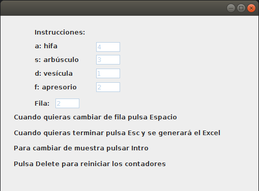

# Esporas
Spores is an application for the control of the aprision of hifas, apresorios, vesículas and arbúsculos.



# Documentation

0. [Installation](#installation-and-requirements)
1. [How to use](#how-to-use)
2. [Hotkeys](#hotkeys)
4. [Acknowledgements](#Acknowledgements)


## Installation and Requirements

Esporas can be run on Linux and Windows. 


### Build from source
#### Using Linux

1. Clone this repository.
```bash
git clone https://github.com/ancasag/esporas
```
2. Give execute properties to esporas.jar:
```bash
right click esporas.jar and give permision
```
3. Run esporas.jar:
```bash
double click esporas.jar
```
#### Using Windows

1. Clone this repository.
```bash
git clone https://github.com/ancasag/esporas
```
2. Run esporas.jar:
```bash
double click esporas.jar
```
## How to use

Here is the video to learn how to use App Esporas with a example.

[](https://youtu.be/RWCC7xx8QwA)

## Hotkeys
|          |                                |
|----------|--------------------------------|
| a        | Select Hifa                  |
| s        | Select  Arbúsculo         |
| d        | Select Vesícula                  |
| f        | Select Apresorio                |
| space | Change row            |
| esc     | Generate excel                 |
| intro   | Create a new stoma detection   |
| supr    | Restart the score |


